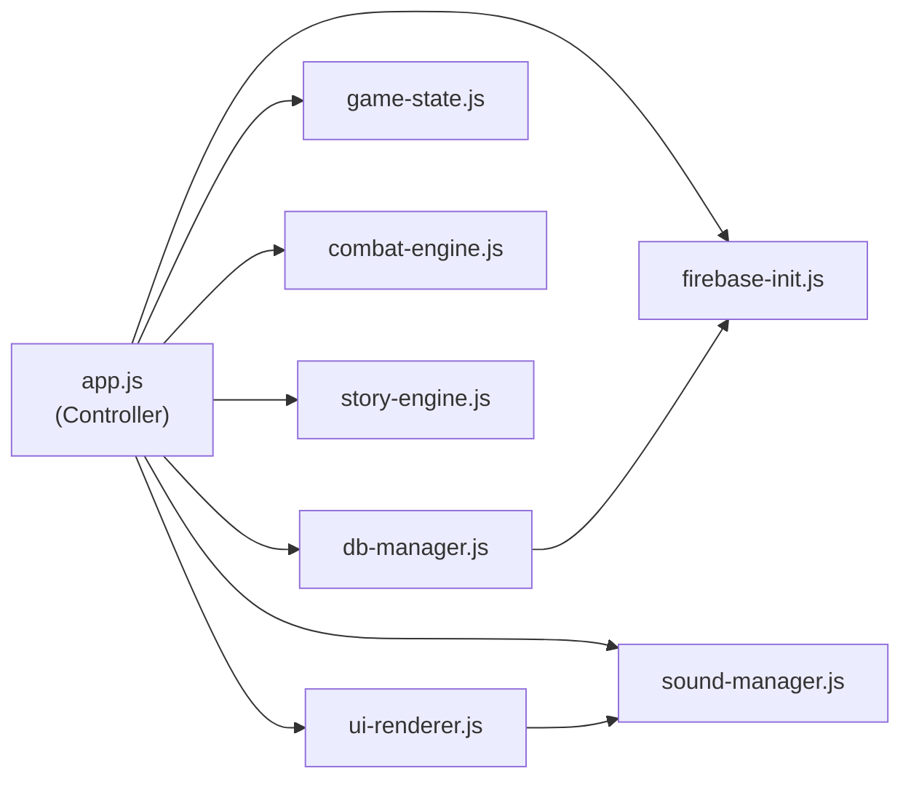

# 📐 PachinkoHero — Module Architecture Reference

> **목적:** 모듈별 exported/internal 함수 카탈로그.  
> 새 SPEC 작성 시 이 문서를 참조하여 "어떤 함수를 수정/추가/호출하는지" 명시합니다.  
> 코드 변경 후 반드시 이 문서도 동기화해 주세요.

---

## 1. `firebase-init.js` — Firebase SDK 초기화 + Auth

| 구분 | 함수명 | 시그니처 | 설명 |
|------|--------|----------|------|
| export | `initFirebase` | `() → { app, auth, db }` | Firebase 앱/Auth/Firestore 초기화 (싱글턴) |
| export | `signIn` | `() → Promise<UserCredential>` | Google 팝업 로그인 |
| export | `logOut` | `() → Promise<void>` | 로그아웃 |
| export | `onAuthChange` | `(callback) → Unsubscribe` | `onAuthStateChanged` 래퍼 |
| export | `getFirestoreDb` | `() → Firestore` | Firestore 인스턴스 반환 |
| export | `getAuthInstance` | `() → Auth` | Auth 인스턴스 반환 |

**내부 상태:** `firebaseApp`, `firebaseAuth`, `firestoreDb`, `googleProvider`, `persistenceInitialized` (모듈 스코프 let)

---

## 2. `db-manager.js` — Firestore 데이터 로드/세이브

| 구분 | 함수명 | 시그니처 | 설명 |
|------|--------|----------|------|
| export const | `GAME_DATA_DOC_COUNT` | `number` | GameData 문서 개수 (progress 계산용) |
| export | `loadGameData` | `() → Promise<GameDataCache>` | GameData 8문서 병렬 로드 + deepFreeze 캐싱 |
| export | `loadGameDataWithProgress` | `(onProgress) → Promise<GameDataCache>` | GameData 병렬 로드 + 문서별 progress 콜백 |
| export | `loadUserData` | `(authSource, authProfile?, onTrace?) → Promise<UserDoc>` | Users/{uid} 로드 (없으면 초기 문서 생성, 계측 trace 콜백 지원) |
| export | `saveCurrentRun` | `(uid, currentRun) → Promise<void>` | currentRun 필드 Auto-save + localStorage 백업 미러링 |
| export | `saveUserMeta` | `(uid, meta) → Promise<void>` | 유저 메타 정보 저장 (재화/기록 등) |
| export | `submitRanking` | `(rankingEntry) → Promise<DocRef>` | 랭킹 엔트리 추가 |
| export | `loadTopRankings` | `(maxEntries?) → Promise<RankingEntry[]>` | 상위 랭킹 조회 |
| internal | `deepFreeze` | `(value) → value` | 재귀 Object.freeze |
| internal | `cloneData` | `(value) → clone` | JSON 깊은 복사 |
| internal | `getLocalBackupKey` | `(uid) → string` | currentRun localStorage 키 생성 |
| internal | `mirrorLocalBackup` | `(uid, currentRun) → void` | currentRun localStorage 미러 저장 |
| internal | `createGameDataLoadPromise` | `(onProgress?) → Promise<GameDataCache>` | GameData 병렬 로드 공통 구현 (문서별 duration/fromCache 메타 전달) |
| internal | `normalizeAuthSource` | `(authSource, authProfile?) → AuthProfile` | Firebase User 또는 uid 문자열을 통일된 프로필로 변환 |
| internal | `buildInitialUserDoc` | `(authProfile) → UserDoc` | 최초 등록 유저 문서 생성 (`crystals`, `upgrades` 기본값 포함) |
| internal | `buildUserFallback` | `(authProfile) → UserDoc` | 오프라인 등 fallback 유저 문서 (`crystals`, `upgrades` 기본값 포함) |

**내부 상태:** `gameDataCache`, `gameDataPromise` (중복 로드 방지)

---

## 3. `game-state.js` — 단일 스토어 + 구독/발행

| 구분 | 함수명 | 시그니처 | 설명 |
|------|--------|----------|------|
| export const | `AppState` | `Enum{BOOT,AUTH,LOBBY,UPGRADE,RUN_START,ORIGIN_SELECT,...PAYOUT}` | 앱 상태 열거형 (15개) |
| export | `getState` | `() → State` | 현재 전체 상태 반환 |
| export | `setState` | `(partial) → void` | 부분 상태 업데이트 + 리스너 알림 |
| export | `subscribe` | `(listener) → Unsubscribe` | 상태 변경 구독 |

**State 구조:**
```js
{
  uiState: { screen, authBusy, authMessage, bootMessage, bootProgress },
  user: null | UserDoc,
  currentRun: null | RunState, // RunState.combatContext 포함
  gameData: null | GameDataCache,
  combatState: null | CombatState,
  endingState: null | EndingState,
}
```

---

## 4. `combat-engine.js` — 룰렛 전투 엔진 (순수 로직)

| 구분 | 함수명 | 시그니처 | 설명 |
|------|--------|----------|------|
| export | `spin` | `(deck, symbolsData, options?) → SpinResult` | 룰렛 스핀 실행 (`typeCounts`, `synergies`, `finalTotals` 포함) |
| export | `calculateSynergies` | `(spinEntries, synergyDefs) → SynergyResult[]` | 시너지 발동 목록 계산 |
| export | `calculateDamage` | `(attack, defense, armorConstant) → number` | 데미지 계산 (순수 함수) |
| export | `executeCombatRound` | `(params) → RoundResult` | 전투 1라운드 실행 (스핀/preview 확정→데미지→적 공격→승패) |
| export | `createCombatState` | `(enemy, options?) → CombatState` | 전투 상태 초기화 (`isAwaitingSpinCommit` 포함) |
| export | `buildCombatEnemy` | `(monstersData, monsterId) → CombatEnemy` | 몬스터 데이터로 적 생성 |
| internal | `addSymbolToDeck` | `(deck, symbolId) → DeckResult` | 덱에 기물 추가 |
| internal | `applyMonsterRewards` | `(enemy, playerState, randomFn?) → RewardResult` | 몬스터 처치 보상 적용 |
| internal | `createBonusTotals` | `() → BonusTotals` | 시너지 보너스 합계 기본값 생성 |
| internal | `calculateTypeCounts` | `(entries) → Record<string, number>` | 스핀 결과 타입 카운트 계산 |
| internal | `enhanceSpinDetail` | `(spinDetail, synergyDefs?) → SpinResult` | 시너지/최종 합계를 붙인 스핀 결과 생성 |
| internal | `normalizeProvidedSpinDetail` | `(spinDetail, symbolsData, synergyDefs?) → SpinResult` | 저장/preview 스핀 결과 정규화 |
| internal | `cloneData` | `(value) → clone` | JSON 깊은 복사 |
| internal | `toFiniteNumber` | `(value, fallback?) → number` | 안전한 숫자 변환 |
| internal | `clamp` | `(value, min, max) → number` | 범위 제한 |
| internal | `randomIntInRange` | `(min, max, randomFn?) → number` | 범위 내 정수 난수 |
| internal | `getFilledDeck` | `(deck) → Symbol[]` | 비어있지 않은 슬롯만 필터 |
| internal | `buildSpinEntry` | `(symbolId, symbolsData) → SpinEntry` | 스핀 결과 엔트리 생성 |
| internal | `createEvent` | `(type, message, extra?) → Event` | 전투 이벤트 로그 생성 |

---

## 5. `story-engine.js` — 스토리 노드/선택지 엔진

| 구분 | 함수명 | 시그니처 | 설명 |
|------|--------|----------|------|
| export | `createInitialRun` | `(classId, config, userUpgrades?, options?) → RunState` | 새 런 상태 생성 (직업 선택 후, 출신지/업보/영구 강화 보너스 반영) |
| export | `createInactiveRunState` | `(overrides?) → RunState` | isActive=false 런 상태 |
| export | `normalizeRunState` | `(playerState?) → RunState` | 불완전 런 상태 정규화 |
| export | `loadNode` | `(nodeId, storyData, playerState) → RenderModel` | 스토리 노드를 렌더 모델로 로드 |
| export | `applyChoice` | `(choice, playerState, options?) → { nextNodeId, updatedState }` | 선택지 효과 적용 + 다음 노드 계산 |
| export | `rollEncounter` | `(pool, encountersData, playerState, randomFn?) → Encounter\|null` | 인카운트 롤 (가중치+조건) |
| export | `applyRewardEncounter` | `(encounter, playerState, randomFn?) → RewardResult` | 보상형 인카운트 적용 |
| export | `checkEnding` | `(endingsData, playerState) → EndingId\|null` | 엔딩 조건 체크 |
| export | `resolveEndingId` | `(requestedId, endingsData, playerState, fallback?) → EndingId` | 엔딩 ID 확정 (조건 불충족 시 fallback) |
| export | `calculateEndingOutcome` | `(endingId, endingsData, playerState) → EndingOutcome` | 엔딩 결과 (보상/랭킹) 계산 |
| export | `buildInitialDeck` | `(classId, bagCapacity) → Deck` | 직업별 초기 덱 생성 |
| export | `meetsConditions` | `(conditions, playerState) → boolean` | 조건 판정 (flags/스테이지/karma) |
| export | `applyEffects` | `(effects, playerState, options?) → PlayerState` | 효과 적용 (flags/HP/골드/스테이지/karma) |
| export | `advanceStage` | `(playerState, amount?) → PlayerState` | 스테이지 진행 |
| export | `addSymbolToDeck` | `(playerState, symbolId) → DeckResult` | 덱에 기물 추가 |
| export | `countFilledDeckSlots` | `(playerState) → number` | 채워진 덱 슬롯 수 |
| export | `hasEmptyDeckSlot` | `(playerState) → boolean` | 빈 슬롯 존재 여부 |
| export | `pushReturnNode` | `(playerState, nodeId) → PlayerState` | 복귀 노드 스택에 push |
| internal | `cloneJsonCompatible` | `(value) → clone` | JSON 깊은 복사 |
| internal | `toFiniteNumber` | `(value, fallback?) → number` | 안전한 숫자 변환 |
| internal | `toArray` | `(value) → Array` | 안전한 배열 변환 |
| internal | `normalizeCombatContext` | `(combatContext?) → CombatContext\|null` | 저장된 전투 컨텍스트 정규화 |
| internal | `calculateUpgradeBonuses` | `(config, userUpgrades) → UpgradeBonuses` | 강화 정의 기준 시작 보너스 계산 |
| internal | `resolveKarmaBounds` | `(config?) → { min, max }` | config.karma 기반 업보 범위 계산 |
| internal | `meetsNonKarmaConditions` | `(conditions, playerState) → boolean` | flag/stage 조건 판정 (karma 제외) |
| internal | `getKarmaBlockedReason` | `(conditions, playerState) → string` | 업보 조건 미충족 사유 텍스트 생성 |
| internal | `clamp` / `randomIntInRange` | — | 유틸리티 (combat-engine과 동일) |

**상수:** `STARTING_DECK_RECIPES` (직업별 초기 무기 구성)

---

## 6. `ui-renderer.js` — DOM 렌더링

| 구분 | 함수명 | 시그니처 | 설명 |
|------|--------|----------|------|
| export | `createIcon` | `(iconPath, altText, className?) → Element` | 아이콘 이미지 요소 생성 |
| export | `bindUIActions` | `(handlers) → void` | UI 이벤트 핸들러 바인딩 |
| export | `renderScreen` | `(screenId) → void` | 화면 전환 (show/hide) |
| export | `setBootStatus` | `(message, options?) → void` | 부트 화면 상태 표시 |
| export | `setBootProgress` | `(current, total, label) → void` | 부트 프로그레스 바/라벨 갱신 |
| export | `setAuthStatus` | `(options) → void` | 인증 화면 상태 표시 |
| export | `renderSoundControls` | `(bgmVol, sfxVol, onChange?) → void` | 전역 사운드 컨트롤 UI 갱신 |
| export | `renderLobby` | `(user, currentRun?, options?) → void` | 로비 화면 렌더 (결정/강화 버튼, 닉네임 입력/저장 상태 포함) |
| export | `renderOriginSelection` | `(originCards, options?) → void` | 출신지 선택 화면 렌더 |
| export | `renderClassSelection` | `(classCards, options?) → void` | 직업 선택 화면 렌더 (`copyText`, `locked` 지원) |
| export | `renderStory` | `(renderModel, context) → void` | 스토리/상점 화면 렌더 (karma HUD, choice hint/disabled reason 포함) |
| export | `renderUpgradeShop` | `(upgradeDefs, userUpgrades, crystals, options?) → void` | 강화 상점 화면 렌더 |
| export | `showRerollOption` | `(cost, gold, onReroll) → void` | 전투 리롤 버튼/비용 표시 |
| export | `renderCombat` | `(combatState, currentRun, gameData) → void` | 전투 화면 렌더 (호환 래퍼) |
| export | `renderCombatScreen` | `(combatState, currentRun, gameData) → void` | 전투 화면 전체 렌더 (preview/reroll UI 포함) |
| export | `renderCombatRoundResult` | `(roundResult, combatState, symbolsData) → Promise<void>` | 전투 1라운드 연출 |
| export | `renderCombatVictory` | `(rewardSummary, symbolsData) → void` | 전투 승리 연출 |
| export | `renderCombatDefeat` | `(player) → void` | 전투 패배 연출 |
| export | `renderEndingView` | `(screenId, endingState, user) → void` | 엔딩/랭킹/정산 화면 렌더 |
| export | `showToast` | `(message, type?) → void` | 토스트 알림 표시 |
| internal | `getElements` | `() → Elements` | DOM 요소 캐싱 (싱글턴) |
| internal | `formatNumber` | `(value) → string` | 숫자 포맷 |
| internal | `formatSignedNumber` | `(value) → string` | 부호 포함 숫자 포맷 |
| internal | `clearChildren` | `(element) → void` | 자식 노드 전부 제거 |
| internal | `createTextElement` | `(tagName, className, text) → Element` | 텍스트 요소 생성 |
| internal | `createIconFallback` | `(altText, className?) → Element` | 이미지 로드 실패 시 fallback 생성 |
| internal | `resetBootProgressDom` | `(dom) → void` | 부트 프로그레스 DOM 리셋/숨김 |
| internal | `createChip` | `(text, className?) → Element` | 칩(태그) 요소 생성 |
| internal | `createStatCard` | `(label, value) → Element` | 엔딩/정산 카드 생성 |
| internal | `countFilledDeckSlots` | `(deck) → number` | 채워진 덱 슬롯 수 (렌더용) |
| internal | `formatPercent` | `(value) → string` | 볼륨 퍼센트 문자열 변환 |
| internal | `wait` | `(durationMs) → Promise<void>` | 전투 연출 지연 |
| internal | `getUpgradeEffectLabel` | `(effect) → string` | 강화 효과 요약 텍스트 생성 |
| internal | `extractEventValue` | `(events, eventType) → number` | 이벤트 메시지에서 수치 추출 |
| internal | `removeDamageNumbers` | `(container) → void` | 전투 숫자 팝업 정리 |
| internal | `setEnemyHpBar` | `(currentHp, maxHp, options?) → void` | 적 HP 바 내부 갱신 |
| internal | `updatePlayerHud` | `(playerState) → void` | 플레이어 전투 HUD 내부 갱신 |
| internal | `createSpinSlot` | `(entry) → Element` | 스핀 결과 슬롯 카드 생성 |
| internal | `appendSpinSummary` | `(spinDetail) → void` | 스핀 합계 요약 추가 |
| internal | `renderCombatLogEntries` | `(logs) → void` | 전투 로그 DOM 렌더 |

**상수:** `LOG_LIMIT=500`, `TOAST_LIMIT=4`, `TOAST_DURATION_MS=3800`, `SCREEN_IDS` 매핑

---

## 7. `sound-manager.js` — 사운드 UI 상태 보존용 임시 스텁

| 구분 | 함수명 | 시그니처 | 설명 |
|------|--------|----------|------|
| export | `initSoundManager` | `(soundConfig?) → void` | 사운드 설정 로드 + localStorage 볼륨 복원 (재생 없음) |
| export | `playBGM` | `(trackId) → Promise<void>` | 현재 트랙 ID만 기록하는 no-op |
| export | `stopBGM` | `() → void` | 현재 트랙 ID 초기화 |
| export | `playSFX` | `(sfxId) → void` | 효과음 재생 no-op |
| export | `setVolume` | `(type, level) → void` | BGM/SFX 볼륨 상태 저장 |
| export | `getVolume` | `(type) → number` | 현재 볼륨 조회 |
| export | `setMuted` | `(nextMuted) → void` | 음소거 상태 저장 |
| export | `isMuted` | `() → boolean` | 음소거 여부 조회 |
| internal | `clampVolume` | `(level, fallback) → number` | 볼륨 0~1 정규화 |
| internal | `getStorage` | `() → Storage\|null` | localStorage 접근 래퍼 |
| internal | `persistVolume` | `(type, value) → void` | 볼륨 localStorage 저장 |
| internal | `persistMute` | `() → void` | 음소거 localStorage 저장 |
| internal | `loadVolumeSettings` | `() → void` | localStorage에서 볼륨/음소거 복원 |
 
**비고:** 실제 오디오 재생은 자산 교체 전까지 비활성화. UI 슬라이더/음소거 토글만 유지합니다.

**내부 상태:** `state` (config/currentTrackId/volume/muted)

---

## 8. `app.js` — 메인 컨트롤러

| 구분 | 함수명 | 시그니처 | 설명 |
|------|--------|----------|------|
| (entry) | `boot` | `() → Promise<void>` | 앱 부트 (Firebase → Auth → 화면 전환) |
| internal | `transitionTo` | `(nextScreen) → void` | 화면 전환 (setState 래퍼) |
| internal | `normalizeNickname` | `(value) → string` | 닉네임 공백 정리 + 16자 제한 정규화 |
| internal | `getLocalBackupKey` | `(uid) → string` | currentRun localStorage 키 생성 |
| internal | `saveLocalBackup` | `(uid, data) → void` | currentRun 오프라인 백업 저장 |
| internal | `loadLocalBackup` | `(uid) → RunState\|null` | currentRun 오프라인 백업 로드 |
| internal | `clearLocalBackup` | `(uid) → void` | currentRun 오프라인 백업 삭제 |
| internal | `getBgmTrackForScreen` | `(screen) → trackId` | 화면 상태 → BGM 트랙 매핑 |
| internal | `syncSoundControls` | `() → void` | 전역 사운드 컨트롤 UI 동기화 |
| internal | `getPerfNow` | `() → number` | 브라우저/폴백 타이머에서 현재 시각(ms) 반환 |
| internal | `formatPerfDuration` | `(durationMs) → string` | ms 값을 로그용 문자열로 포맷 |
| internal | `getNavigationMetrics` | `() → NavigationMetrics\|null` | Navigation Timing API에서 초기 로드 메타 추출 |
| internal | `storePerfReport` | `(report) → void` | 마지막 성능 리포트와 히스토리를 `window.__PH_PERF_*`에 저장 |
| internal | `createPerfSession` | `(label, context?) → PerfSession` | 단계별 시간 수집/콘솔 테이블 출력 세션 생성 |
| internal | `updateBootProgressState` | `(current, total, label) → void` | uiState.bootProgress + 부트 바 동기화 |
| internal | `resetBootProgressState` | `() → void` | 부트 프로그레스 초기화 |
| internal | `loadAllDataParallel` | `(authUser, perfSession?) → Promise<{gameData, user}>` | GameData/UserData 병렬 로드 + progress/fallback 처리 + 계측 기록 |
| internal | `renderLobbyState` | `() → void` | 현재 상태 기반 로비 렌더 |
| internal | `handleNicknameSave` | `(rawNickname) → Promise<void>` | 로비 닉네임 저장 처리 (`Users/{uid}.displayName`) |
| internal | `formatRewardToast` | `(encounter, rewardSummary, symbolsData) → string` | 보상 토스트 메시지 생성 |
| internal | `formatCombatRewards` | `(rewardSummary, symbolsData) → string` | 전투 보상 토스트 메시지 생성 |
| internal | `cloneJsonCompatible` | `(value) → clone` | JSON 깊은 복사 |
| internal | `wait` | `(durationMs) → Promise<void>` | 전투/연출 지연 |
| internal | `getUpgradeDefinitions` | `() → UpgradeDefs` | GameData/config 기반 강화 정의 조회 |
| internal | `hasUpgradeShop` | `() → boolean` | 강화 상점 노출 가능 여부 |
| internal | `buildCombatContext` | `(monsterId, combatState) → CombatContext\|null` | currentRun 저장용 전투 컨텍스트 생성 |
| internal | `renderUpgradeState` | `() → void` | 현재 상태 기준 강화 상점 렌더 |
| internal | `calculateCrystalReward` | `(endingResult, config) → number` | 엔딩 정산 시 획득 결정 계산 |
| internal | `handleGoogleLogin` | `() → Promise<void>` | 구글 로그인 처리 |
| internal | `handleLogout` | `() → Promise<void>` | 로그아웃 처리 |
| internal | `handleSignedOut` | `() → void` | 로그아웃 후 상태 정리 |
| internal | `restoreAuthenticatedSession` | `(authUser, inheritedPerfSession?) → Promise<void>` | 인증 세션 복구 (데이터 로드 + 런 복구 + 계측 리포트 출력) |
| internal | `startAppBootstrap` | `() → void` | DOMContentLoaded 이전/이후 모두 안전하게 앱 부트를 시작 |
| internal | `persistRun` | `(runSnapshot, options?) → Promise<boolean>` | currentRun 즉시 저장 |
| internal | `queueAutoSave` | `(reason, runOverride?) → Promise<boolean>` | debounce 기반 Auto-save 예약 |
| internal | `flushQueuedAutoSave` | `() → Promise<boolean>` | 예약된 Auto-save 즉시 실행 |
| internal | `cancelQueuedAutoSave` | `() → void` | 예약 저장 취소 |
| internal | `deactivateCurrentRun` | `(overrides?) → void` | 현재 런 비활성화 |
| internal | `failToLobby` | `(message, error?) → void` | 오류 시 로비 복귀 |
| internal | `formatSignedValue` | `(value) → string` | 업보 부호 포함 문자열 생성 |
| internal | `buildClassSelectionModels` | `(gameData) → ClassCard[]` | 직업 선택 카드 모델 생성 |
| internal | `buildOriginSelectionModels` | `(gameData) → OriginCard[]` | 출신지 선택 카드 모델 생성 |
| internal | `getSelectedOrigin` | `(gameData, currentRun?) → Origin\|null` | 현재 선택된 출신지 데이터 조회 |
| internal | `getClassSelectionCopy` | `(gameData, currentRun?) → string` | 선택된 출신지 기준 직업 선택 안내문 생성 |
| internal | `renderOriginSelectionState` | `() → void` | 현재 상태 기준 출신지 선택 화면 렌더 |
| internal | `renderClassSelectionState` | `() → void` | 현재 상태 기준 직업 선택 화면 렌더 |
| internal | `getLoginErrorMessage` | `(error) → string` | 로그인 에러 메시지 변환 |
| internal | `getLoadErrorMessage` | `(error) → string` | 데이터 로드 에러 메시지 변환 |
| internal | `getStoryNote` | `(renderModel) → string` | 스토리 노트 추출 |
| internal | `createLogBuffer` | `(existingLogs, events) → string[]` | 전투 이벤트 로그 버퍼 생성 |
| internal | `clearTransientViews` | `() → void` | combatState / endingState 초기화 |
| internal | `presentStoryNode` | `(renderModel, currentRun, screen) → void` | 스토리 노드 UI 표현 |
| internal | `pickEncounterMonsterId` | `(encounter) → monsterId\|null` | 전투 인카운트 대상 선택 |
| internal | `renderCurrentCombatScreen` | `() → void` | 현재 combatState 재렌더 |
| internal | `renderCurrentEndingScreen` | `() → void` | 현재 endingState 재렌더 |
| internal | `startCombat` | `(monsterId, baseRun, options?) → boolean` | 전투 상태 생성 + COMBAT 전환 |
| internal | `createCombatSpinPreview` | `(currentRun, gameData) → SpinResult` | 전투 preview 스핀 결과 생성 |
| internal | `resolveCombatRound` | `(currentRun, combatState, spinDetail) → Promise<void>` | preview 확정 후 전투 라운드 해결 |
| internal | `handleEndingNode` | `(renderModel, currentRun) → boolean` | 엔딩 노드 처리 |
| internal | `handleDirectCombatNode` | `(renderModel, currentRun, options?) → boolean` | 직접 전투 노드 처리 |
| internal | `enterStoryNode` | `(nodeId, baseRun, options?) → boolean` | 스토리 노드 진입 핵심 로직 |
| internal | `handleEncounterTrigger` | `(renderModel, currentRun) → boolean` | 인카운트 트리거 처리 |
| internal | `resolveRestoreNodeId` | `(run, storyData) → nodeId\|null` | 복구 시 안전한 스토리 노드 계산 |
| internal | `restoreCombatFromRun` | `(currentRun) → boolean` | 저장된 전투 컨텍스트로 COMBAT 화면 복구 |
| internal | `restoreActiveRun` | `(currentRun) → boolean` | currentRun 기반 런 복구 |
| internal | `handleStartRun` | `() → void` | "게임 시작"/"런 이어하기" 처리 |
| internal | `handleOriginSelect` | `(originId) → void` | 출신지 선택 → 임시 런 저장 → CLASS_SELECT 전환 |
| internal | `handleClassSelect` | `(classId) → void` | 직업 선택 → 런 생성 → STORY |
| internal | `handleUpgrade` | `() → void` | LOBBY → UPGRADE 전환 |
| internal | `handleUpgradePurchase` | `(upgradeId) → Promise<void>` | 강화 구매/저장/롤백 처리 |
| internal | `handleUpgradeBack` | `() → void` | UPGRADE → LOBBY 복귀 |
| internal | `handleStoryChoice` | `(choiceIndex) → void` | 스토리 선택지 처리 |
| internal | `handleShopPurchase` | `(symbolId) → void` | 상점 구매 처리 |
| internal | `handleCombatSpin` | `() → Promise<void>` | preview 스핀 생성 또는 현재 결과 확정 |
| internal | `handleCombatReroll` | `() → Promise<void>` | 골드 소모 후 preview 리롤 |
| internal | `finalizeEnding` | `(options?) → Promise<void>` | 정산/랭킹/메타 저장 |
| internal | `handleEndingPrimary` | `() → Promise<void>` | 엔딩 화면 메인 버튼 처리 |
| internal | `handleEndingSecondary` | `() → Promise<void>` | 엔딩 화면 보조 버튼 처리 |

---

## 모듈 의존 관계



> **규칙:** `combat-engine.js`, `story-engine.js`는 DOM/Firebase에 의존하지 않는 순수 로직 모듈입니다.  
> UI나 DB 접근이 필요하면 반드시 `app.js`를 경유합니다.

---

## 업데이트 이력

| 날짜 | 변경 내용 |
|------|-----------|
| 2026-03-09 | Phase 1~5 구현 기준으로 모듈 아키텍처 문서 동기화 |
| 2026-03-09 | Phase 6~8 반영: 강화 상점, 전투 연출/복구, 콘텐츠 확장 기준으로 문서 갱신 |
| 2026-03-09 | Phase 9~13 반영: 전투 리롤/시너지, 사운드, 이미지 placeholder, localStorage 백업, Firestore Rules 기준으로 문서 갱신 |
| 2026-03-09 | Phase 14 반영: Firestore persistence, 병렬 데이터 로드, 부트 progress UI 기준으로 문서 갱신 |
| 2026-03-13 | Karma/Origin/Encounter Story 반영: ORIGIN_SELECT, karma 조건/효과, npc/quest 인카운트, origins GameData 기준으로 문서 갱신 |
